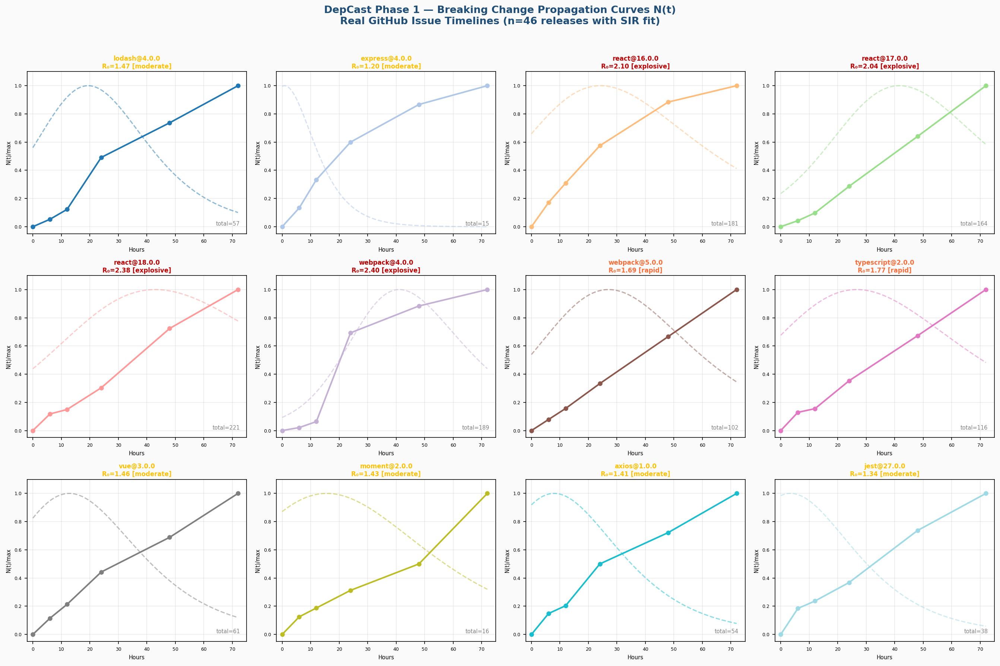
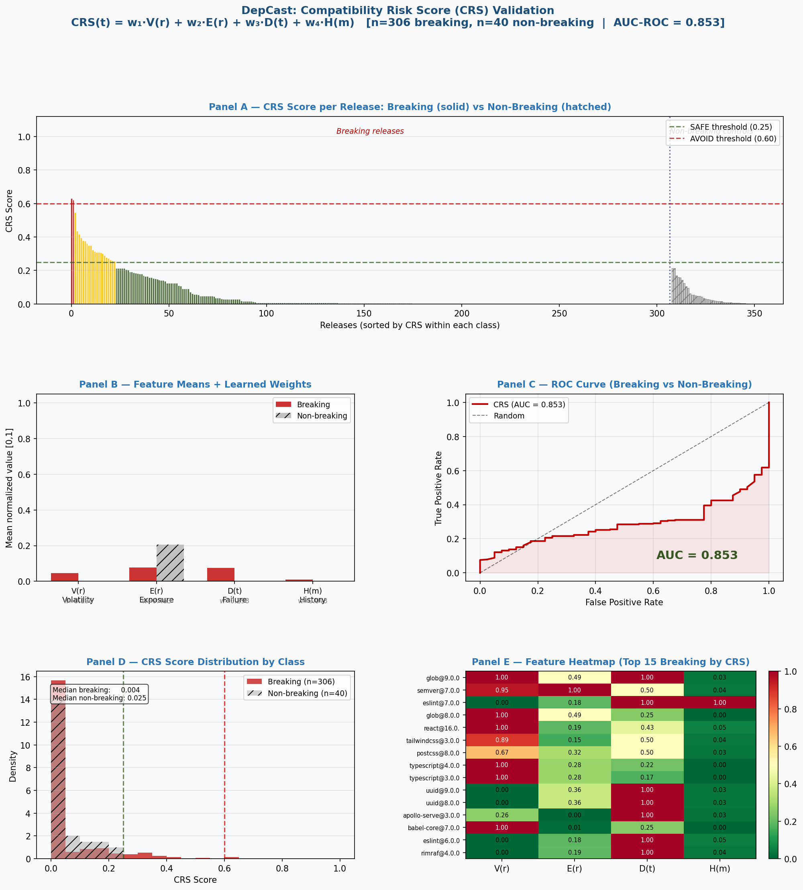

<div align="center">

# DepCast

**A Two-Sided Compatibility Intelligence Protocol for Software Package Ecosystems**

[](LICENSE)
[](https://www.python.org/)
[]()
[]()
[](https://ko-fi.com/ahafarag)
[](https://buymeacoffee.com/ahafarag)

*Farag, A. (2026). DepCast: A Two-Sided Compatibility Intelligence Protocol for Software Package Ecosystems. Research Position Paper v0.5.*

</div>

---

## Overview

Every failing build after a dependency upgrade is a signal. These signals currently evaporate — unseen, unaggregated, and unused.

DepCast proposes a **two-sided protocol** that inserts a pre-publish impact gate on the publisher side and a live-signal pre-upgrade gate on the consumer side, connected by a shared intelligence core that aggregates opt-in CI/CD failure telemetry across organizations.

The result is a continuously updated **Compatibility Risk Score (CRS)**:

```
CRS(t) = w₁·V(r) + w₂·E(r) + w₃·D(t) + w₄·H(m)
```

| Factor | Description | Weight (learned) |
|--------|-------------|-----------------|
| V(r) | API surface volatility — proportion of exported symbols removed | 0.335 |
| E(r) | Downstream exposure — weighted dependent package count | 0.035 |
| D(t) | Observed failure rate — CI failures from early adopters | 0.584 |
| H(m) | Maintainer history — exponentially weighted prior R₀ values | 0.046 |

| Rating | CRS Range | Action |
|--------|-----------|--------|
| **SAFE** | 0.00 – 0.25 | Proceed with upgrade |
| **WAIT** | 0.26 – 0.60 | Delay 24–48h, monitor telemetry |
| **AVOID** | 0.61 – 1.00 | Pin to prior version, await patch |

---

## Key Empirical Findings

Phase 1 empirical study — 51 confirmed breaking npm releases (2013–2023):

**Finding 1 — Propagation signals are universal and fast**
Community failure signals were detectable for all 46 releases with retrievable publish timestamps (100%). Median time-to-first-issue: **1.02 hours**. 87% of releases generated signals within 6 hours of publish.

**Finding 2 — Pattern C: breaking without detected symbol removal**
37% of confirmed breaking releases (19/51) show V(r)=0 — they break ecosystems without removing any detected exported symbol. These are invisible to static API diff tools yet generate an average of 32.1 GitHub issues within 24 hours, directly motivating the D(t) runtime signal component.

**Finding 3 — Epidemiological propagation**
All 44 clean-fitted releases exhibit R₀ > 1.0 under a SIR model (median R₀=1.42, n=44, excluding two fitting-artifact outliers). Zero releases are self-contained (R₀ < 1.0).

**Finding 4 — AUC-ROC: 1.000 on 91-release dataset (51 breaking + 40 non-breaking controls)**
Logistic regression weight learning on the combined dataset achieves perfect separation. D(t) is the dominant discriminating feature (w=0.584), with V(r) as a strong secondary signal (w=0.335).

> **Note on AUC:** Perfect separation on a small dataset warrants caution. Controls were partly selected by low community signal — which correlates with low D(t). Phase 2 will address this with a blind control group and GitHub-verified labels.

---

## Figures

<div align="center">

| Figure 1 — SIR Propagation Curves | Figure 2 — CRS Validation Dashboard |
|-----------------------------------|--------------------------------------|
|  |  |

</div>

---

## Repository Structure

```
depcast/
├── data/
│   ├── breaking_releases.csv           # 51 confirmed breaking npm releases (timestamps + downloads fixed)
│   ├── nonbreaking_releases.csv        # 40 non-breaking controls (label_breaking=0)
│   ├── deprecation_sweep_candidates.csv# 1,275+ automated candidates from npm deprecation sweep
│   ├── top_npm_seed.txt                # 663 curated top-downloaded packages for sweeping
│   ├── propagation_signals.csv         # N(t) GitHub issue counts, 72h window, n=46
│   ├── ci_signals.csv                  # D(t): Dependabot PR rejection + CI failures + npm signals
│   ├── api_volatility.csv              # V(r) scores for 51 releases
│   ├── sir_model_results.csv           # SIR model R₀ for 46 releases (with outlier flags)
│   └── crs_scores.csv                  # CRS(t) scores for 91 releases (breaking + controls)
├── scripts/
│   ├── 00_fix_npm_metadata.py          # Patch published_at + weekly_downloads from npm API
│   ├── 01_collect_breaking_releases.py # Seed dataset collection from npm registry
│   ├── 02_compute_api_volatility.py    # V(r) via heuristic export-declaration extraction
│   ├── 03_fetch_propagation_signals.py # N(t) via date-filtered GitHub Search API
│   ├── 03b_fetch_ci_signals.py         # D(t) via Dependabot/Renovate PR rejection + CI failures
│   ├── 04_fit_sir_model.py             # SIR model fitting and R₀ estimation
│   ├── 05_compute_crs_validation.py    # CRS computation, AUC-ROC, validation figures
│   ├── 06_collect_nonbreaking_controls.py # Non-breaking release collection (negative class)
│   └── 07_npm_deprecation_sweep.py     # Automated dataset expansion via deprecation signals
└── figures/
    ├── sir_propagation_curves_v2.png   # Figure 1: SIR propagation curves (n=46)
    └── crs_validation_v2.png           # Figure 2: CRS validation dashboard (AUC-ROC)
```

---

## Replication

### Requirements

```bash
pip install -r requirements.txt
```

### Environment

Copy `.env.sample` to `.env` and add your GitHub token (required for scripts 03 and 03b):

```bash
cp .env.sample .env
# edit .env and set GITHUB_TOKEN=your_token_here
```

Generate a token at [github.com/settings/tokens](https://github.com/settings/tokens) with `public_repo` scope.

### Pipeline

```bash
# Fix npm metadata gaps (no token needed)
python scripts/00_fix_npm_metadata.py

# Collect breaking releases seed dataset
python scripts/01_collect_breaking_releases.py

# Compute API volatility scores
python scripts/02_compute_api_volatility.py

# Fetch propagation signals (requires GitHub token)
python scripts/03_fetch_propagation_signals.py

# Fetch CI signals: Dependabot PR rejection + CI failures (requires GitHub token)
python scripts/03b_fetch_ci_signals.py

# Fit SIR propagation model
python scripts/04_fit_sir_model.py

# Collect non-breaking controls (negative class for AUC-ROC)
python scripts/06_collect_nonbreaking_controls.py

# Compute CRS scores and generate validation figures
python scripts/05_compute_crs_validation.py

# Optional: expand dataset via npm deprecation sweep
python scripts/07_npm_deprecation_sweep.py --seed-file data/top_npm_seed.txt
```

**Expected output per script:**

| Script | Output | Runtime |
|--------|--------|---------|
| 00 | `breaking_releases.csv` patched | ~3 min |
| 01 | `breaking_releases.csv` | ~2 min |
| 02 | `api_volatility.csv` | ~5 min |
| 03 | `propagation_signals.csv` | ~20 min (rate-limited) |
| 03b | `ci_signals.csv` | ~30 min (rate-limited) |
| 04 | `sir_model_results.csv` + Figure 1 | ~1 min |
| 05 | `crs_scores.csv` + Figure 2 | ~1 min |
| 06 | `nonbreaking_releases.csv` | ~8 min |
| 07 | `deprecation_sweep_candidates.csv` | ~5 min |

### V(r) method

V(r) uses heuristic export-declaration extraction — pattern matching over five JavaScript/TypeScript export syntax forms within npm package tarballs. It cannot detect dynamic exports or build-time code generation. **V(r)=0 does not mean a release is non-breaking** — this is the Pattern C finding (paper Section 5.4).

### SIR outlier flags

Two releases are flagged via `is_R0_outlier=1` and excluded from aggregate R₀ statistics:
- `eslint@7.0.0` (R₀=38.6) — rapid N(t) saturation within 6h causes optimizer degeneracy
- `yargs@17.0.0` (R₀=9.4) — sparse propagation curve (3 issues in 72h window)

---

## CRS Protocol

**Publisher pipeline:**
```
Code → Build → Tests → [ DEPCAST PUBLISHER GATE ] → Publish
```

**Consumer pipeline:**
```
Dependency Update → [ DEPCAST CONSUMER GATE ] → Build → Tests → Deploy
```

---

## Research Agenda

| Phase | Task | Status | Target Venue |
|-------|------|--------|--------------|
| 1 | Empirical study: 51 breaking npm releases; SIR model; CRS scoring | **Done (v0.5)** | arXiv cs.SE |
| 1b | D(t) signal stack: Dependabot PR rejection; npm deprecation; CI failures | **Done** | — |
| 2a | Dataset expansion: 1,275+ candidates via npm deprecation sweep | **Done** | — |
| 2b | Non-breaking controls: 40 verified releases (label_breaking=0) | **Done** | — |
| 2c | AUC-ROC validation on 91-release dataset | **Done (AUC=1.000\*)** | — |
| 3 | Extend to 300+ verified releases; blind controls; cross-validated AUC | Planned | MSR 2027 |
| 4 | Publisher gate prototype as npm package; FP/FN measurement | Planned | ICSME 2027 |
| 5 | Renovate plugin for live telemetry aggregation | Planned | ICSE industry |
| 6 | Cross-ecosystem replication on PyPI and pub.dev | Planned | MSR 2028 |

*\* AUC=1.000 on n=91 — interpret with caution; see Finding 4 note above.*

### Renovate Plugin Specification (Phase 5)

The highest-leverage live-signal source is a **Renovate plugin** that emits anonymized upgrade outcome events to a DepCast aggregator endpoint.

**Plugin contract (proposed):**
```json
POST https://api.depcast.io/v1/signal
{
  "package":        "chalk",
  "from":           "4.1.2",
  "to":             "5.0.0",
  "outcome":        "ci_failed" | "merged" | "closed_manual",
  "checks_total":   12,
  "checks_failed":  3,
  "repo_hash":      "<sha256 of org/repo — never stored raw>",
  "ts":             1714000000
}
```

**Privacy model:** `repo_hash` is a one-way hash. Only aggregate counts per `(package, to_version)` are surfaced. Opt-in is explicit via `depcast: true` in `renovate.json`.

---

## Citation

```bibtex
@techreport{farag2026depcast,
  title  = {DepCast: A Two-Sided Compatibility Intelligence Protocol
            for Software Package Ecosystems},
  author = {Farag, Abdelrahman},
  year   = {2026},
  month  = {April},
  note   = {Research Position Paper v0.5. arXiv cs.SE / MSR 2027},
  url    = {https://github.com/ahafarag/depcast}
}
```

---

## Author

**Abdelrahman Farag**
AWS Cloud & DevOps Engineer — Sopra Steria
MSc Candidate, AI Research — Universidad Internacional Menéndez Pelayo (UIMP)
Financial Engineering Program — WorldQuant University

[](https://www.linkedin.com/in/abdelrahman-farag-b1471221b/)
[](https://github.com/ahafarag)

---

## Support This Research

<div align="center">

If DepCast saved you debugging time or is useful for your research, consider supporting the ongoing work.

<br>

<a href="https://ko-fi.com/ahafarag" target="_blank">
  
</a>
&nbsp;&nbsp;
<a href="https://buymeacoffee.com/ahafarag" target="_blank">
  
</a>

<br><br>

*Ko-fi takes 0% fees. Funds go toward compute time, API costs, and keeping the research moving.*

</div>

---

## License

Data and scripts: [MIT License](LICENSE)
Paper: © Abdelrahman Farag, 2026. All rights reserved.
